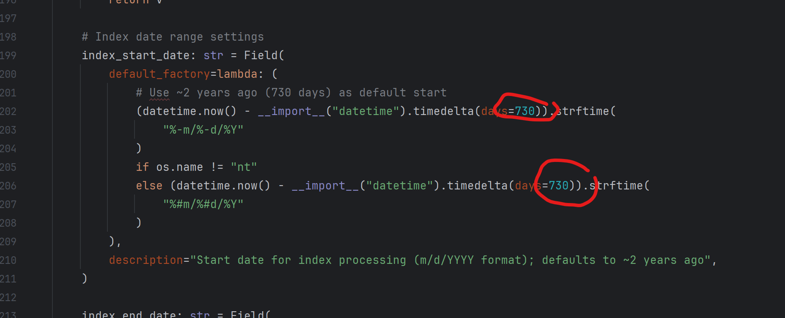
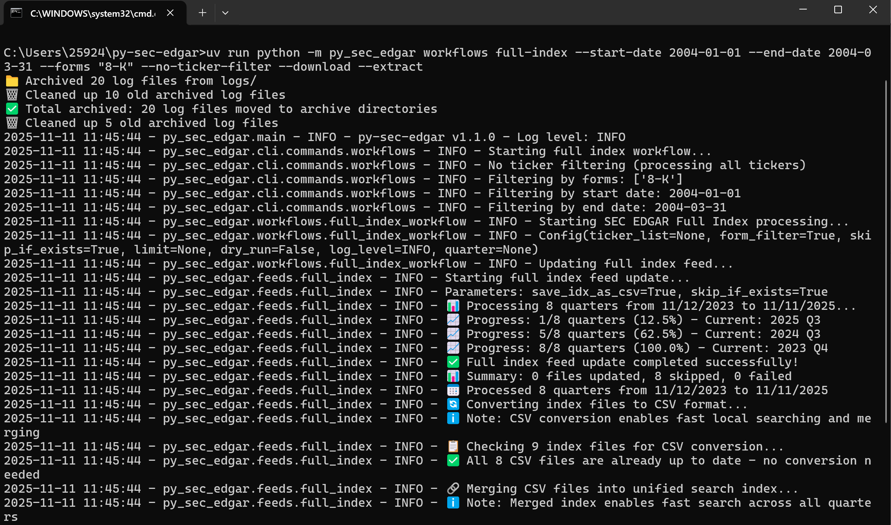
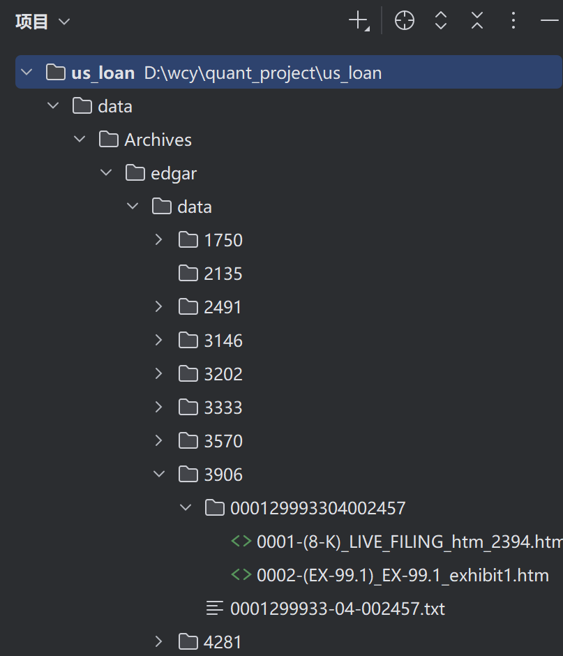

# 1 数据下载

使用插件下载： https://github.com/ryansmccoy/py-sec-edgar

### 1.1.使用uv下载 Install with uv (Recommended)

win+r 打开 cmd 终端，一行行复制到 cmd 运行如下语句（#后为注释不要复制）：

```
# Install uv if you haven't already
pip install uv

# Clone and setup the project
git clone https://github.com/ryansmccoy/py-sec-edgar.git
cd py-sec-edgar

# Install dependencies
uv sync

# Verify installation
uv run python -m py_sec_edgar --help
```

完成后你可以在你的 `C:\Users\你的用户名` 目录下看到该项目：


然后你需要打开文件，打开里面的setting文件并修改，路径为：`C:\Users\你的用户名\py-sec-edgar\src\py_sec_edgar\settings.py`

**把setting.py里的第200行左右的代码里的时间改成8030天，即22年前开始**




然后在cmd命令行中输入：
```cmd
uv run python -m py_sec_edgar workflows full-index --start-date 2004-01-01 --end-date 2004-03-31 --forms "8-K" --no-ticker-filter --download --extract
```

这里`--start-date 2004-01-01 --end-date 2004-03-31` **需要自己调整**，一般来说**建议一个季度下载一次**



ps：第一次运行需要回溯数据时间较长

如果你退出了cmd界面，那么就需要重新转到项目中，只需要在新的命令行输入
```
cd py-sec-ed
```


然后再输入下载命令即可

下载的数据路径在：`C:\Users\你的用户名\py-sec-edgar\data`

结构如下：




