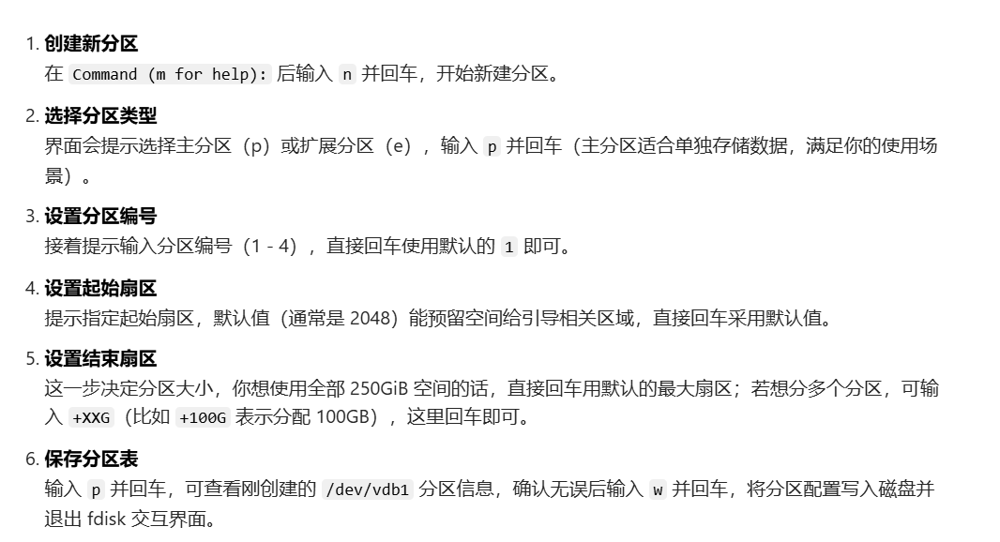
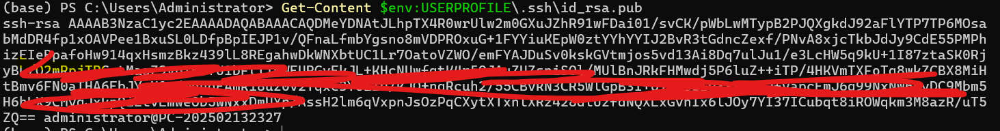

# 服务器环境配置

## 1.挂载数据盘

输入，命令查看数据盘：

```
fdisk -l
```

给数据盘 `/dev/vdb` 创建分区（使用全部 250GiB 空间）：

```bash
fdisk /dev/vdb
```



**格式化分区**：先将创建好的 `/dev/vdb1` 分区格式化为 ext4 格式（主流且稳定的 Linux 文件系统），执行命令：

```bash
mkfs.ext4 /dev/vdb1
```

**创建挂载点并挂载**：挂载点就是访问数据盘的目录、

```
# 创建/data目录作为挂载点
mkdir -p /us_loan
# 将/dev/vdb1分区挂载到/us_loan目录
mount /dev/vdb1 /us_loan
```

切换到对应目录,注意这里创建的目录是和root文件夹并列的，所以前面加个`/`：
```
cd /us_loan
```

## 2.下载miniconda并创建环境

官方源：

```
wget https://repo.anaconda.com/miniconda/Miniconda3-latest-Linux-x86_64.sh
```

然后 bash 对应版本

```
bash Miniconda3-latest-Linux-x86_64.sh
```

开始配置conda环境：

先激活conda:

```
source /root/miniconda3/bin/activate
```

创建环境

```
conda create -n us_loan python=3.12
```

切换到环境：
```
conda activate us_loan
```

接下来就根据本地流程来

## 3 VScode远程链接服务器

获取公钥：
```
Get-Content $env:USERPROFILE\.ssh\id_rsa.pub
```



在服务器端输入：

```
# 1. 创建目录（如果不存在）
mkdir -p ~/.ssh

# 2. 写入公钥 (请把下面的一长串换成你刚才复制的)
echo "ssh-rsa AAAAB3NzaC1yc2EAAAADAQABAAAB..." >> ~/.ssh/authorized_keys

# 3. 修正权限（必须做，否则依然会被拒绝！）
chmod 700 ~/.ssh
chmod 600 ~/.ssh/authorized_keys
```

其他即remote ssh正常操作

在remote界面顶部输入
```
ssh root@[公网ID]
```


## 4.运行

终端输入改为：

```
nohup uv run python -m py_sec_edgar workflows full-index --start-date 2024-01-01 --end-date 2024-12-31 --forms "8-K" --no-ticker-filter --download --extract > output.log 2>&1 &
```

这里 `nohup` 不在终端显示日志，追踪日志要：

```
tail -f output.log
```

ps:日志保存在当前文件夹下

一年数据下载耗时约24小时,数据量在208G
